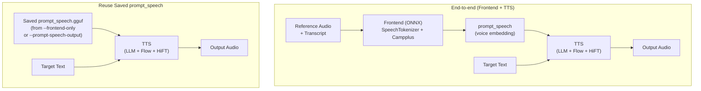

# CosyVoice.cpp

[](LICENSE)
[]()
[](https://github.com/Lourdle/cosyvoice.cpp/releases)
[](https://github.com/Lourdle/cosyvoice.cpp/actions/workflows/build-release.yml)

Language: English | [简体中文](README_zh.md)

> Unofficial project notice: this repository is **not** affiliated with, endorsed by, or maintained by the official CosyVoice team. It is a community-maintained C++/GGML port created by an independent developer.

> **Current status notice:** CPU, CUDA, Metal, and SYCL backends are currently working. The Vulkan backend currently fails to execute properly. Please review [Backend Test Status](#backend-test-status) before production use.

C++/GGML port of the Python CosyVoice inference pipeline, currently focused on **CosyVoice3**.

Supports **zero-shot**, **instruct**, and **cross-lingual** TTS modes with both synchronous and **streaming** output. The frontend pipeline (speech tokenizer + speaker embedding) handles reference audio processing, or pre-encoded `prompt_speech` can be reused across sessions to skip the ONNX frontend entirely.

This project provides:
- A core C/C++ inference library (`cosyvoice`)
- A CLI synthesis tool (`cosyvoice-cli`)
- An OpenAI Speech-compatible API server with embedded WebUI (`cosyvoice-server`)
- A GGUF quantization tool (`quantize`)

## Contents
- [Features](#features)
- [Quick Start](#quick-start)
- [Pre-converted Models](#pre-converted-models)
- [Inference Pipeline](#inference-pipeline)
- [Tooling Guide](#tooling-guide)
- [Build](#build)
- [Streaming TTS & DiT KV Cache](#streaming-tts--dit-kv-cache)
- [Model Conversion to GGUF](#model-conversion-to-gguf)
- [Backend Test Status](#backend-test-status)
- [Troubleshooting](#troubleshooting)
- [Documentation](#documentation)
- [AI Usage Disclosure](#ai-usage-disclosure)
- [Third-Party Notices](#third-party-notices)
- [Licensing](#licensing)
- [Contributing](#contributing)

## Features

| Feature | Description |
|---|---|
| **OpenAI Speech API Server** | Drop-in compatible `POST /v1/audio/speech` endpoint with multi-voice, auth, and CORS support — includes an embedded **WebUI** for model/speaker management and TTS generation |
| **WebUI Dashboard** | Modern browser-based interface for loading/unloading models, registering speakers (via GGUF/audio extraction/mic recording), TTS generation with live playback, history, and full sampling control |
| **Interactive REPL** | CLI interactive mode with slash commands for play, save, list, query, and seed control |
| **Concurrent Serving** | Server `--concurrency` for parallel request handling |
| **Inference Interruption** | Press `Ctrl+C` in CLI or disconnect from the server to stop generation as soon as possible — output up to that point remains valid |
| **Model Quantization** | Quantize GGUF models to smaller formats (Q2_K through F16) with the built-in `quantize` tool |
| **Streaming TTS** | Real-time speech generation with low-latency audio delivery via callback — delivers audio chunks as they are synthesized, before the full utterance completes |
| **DiT KV Cache** | Avoid redundant attention recomputation across diffusion steps during streaming — configurable with fixed (device), offloadable (CPU), and uncached slot categories to trade memory vs. speed |
| **Flash Attention** | LLM and Flow flash attention support (`--llm-flash-attn`, `--flow-flash-attn`) for reduced memory and faster inference when the backend supports it |
| **Chunk Tokens Control** | Tune streaming latency vs. overhead tradeoff via `--chunk-tokens` — smaller chunks reduce first-chunk latency, larger chunks reduce RTF |
| **KV Cache Quantization** | Reduce LLM memory usage via `--llm-kv-cache-type` (f32 / f16 / q8_0 / q5_1 / q4_0 / ...). Supports asymmetric quantization with separate K/V types (e.g. `k=q8_0,v=q4_0`). |
| **Prompt Speech Reuse** | Pre-encode reference voice once, reuse across multiple synthesis runs — no ONNX overhead |
| **Audio Backend Plugins** | Choose MINIAUDIO (default) or FFMPEG for multi-format encoding (WAV, MP3, AAC, FLAC, OPUS, M4A) |
| **UMA Auto-Detection** | Automatically detects unified memory architecture and adjusts buffer policy for optimal throughput |
| **Inference Buffer Policies** | `shared` / `balanced` / `dedicated` buffer modes to trade off memory vs. throughput |
| **Text Splitting & Fade-in** | Smart text splitting for long inputs and configurable output fade-in postprocessing |
| **Multiple Backends** | CPU, CUDA, Metal, SYCL (see [Backend Test Status](#backend-test-status)) |
| **Cross-Platform** | Windows (x64), Linux (x86_64), macOS (arm64) — all tested in CI |

## Quick Start

### Pre-built Releases

The releases provided in this repository do not bundle the GGML backend libraries. To use them:
1. Download `cosyvoice-cli` or `cosyvoice-server` from this repository's [Releases page](https://github.com/Lourdle/cosyvoice.cpp/releases).
2. Download a `llama.cpp` release that matches your hardware and OS.
3. Place the `cosyvoice` executables into the same directory as the GGML backend shared libraries (`ggml.dll`, `ggml-cuda.dll`, etc.).
4. Run from that directory.

> **Known issue with pre-built GGML CUDA backend (Issue [#15](https://github.com/Lourdle/cosyvoice.cpp/issues/15)):** Some users have reported noise in generated audio when using pre-built GGML binaries from `llama.cpp` releases with the CUDA backend. Testing confirmed this issue with pre-compiled GGML CUDA builds, while self-compiled GGML from source did not exhibit the problem. If you encounter noise when using the CUDA backend with pre-built GGML, we recommend building both this project and GGML from source as a workaround. Refer to the [Build](#build) section for instructions.

### Build from Source

```bash
cmake -B build -DCMAKE_BUILD_TYPE=Release
cmake --build build --config Release
```

Outputs in `build/bin` (executables) and `build/lib` (libraries). See [Build](#build) for detailed options, server-specific requirements, and backend configuration.

## Pre-converted Models

Download ready-to-use GGUF models (no conversion needed):

- **ModelScope**: <https://modelscope.cn/models/Lourdle/Fun-CosyVoice3-0.5B-2512-GGUF>
- **Hugging Face**: <https://huggingface.co/Lourdle/Fun-CosyVoice3-0.5B-2512-GGUF>

Pre-quantized variants (Q2_K through F16) are available at the links above.

## Inference Pipeline

This project supports two equivalent inference paths:



- **Path 1 (end-to-end)**: Frontend extracts `prompt_speech` from reference audio + transcript, then TTS synthesizes with target text.
  - `zero-shot` mode requires `--prompt-text`; `instruct` and `cross-lingual` modes ignore it.
- **Path 2 (reuse)**: Run frontend once via `--frontend-only` / `--prompt-speech-output`, then skip it for all subsequent synthesis. This avoids re-running the ONNX model each time.

## Tooling Guide

This repository includes three user-facing tools:
- `cosyvoice-cli`: local file-based TTS generation (supports prompt_speech reuse and frontend + TTS flow).
- `cosyvoice-server`: OpenAI Speech-compatible HTTP API server for service-style integration.
- `quantize`: GGUF quantization utility to convert model files to smaller/faster formats. Supports per-tensor quantization type mapping via PCRE2 regex patterns (`-M/--tensor-map`). Pre-built profiles for CosyVoice3-2512 are available under `tools/quantize/profiles/`.

Full commands, options, and examples are documented in [docs/TOOLS.md](docs/TOOLS.md).

## Build

### Requirements
- CMake >= 3.24
- C/C++ toolchain with C++20 support
- Git (used to fetch GGML automatically when missing)
- x86 CPU with AVX2 support is currently required for parts of the CPU data path
- For CPU math-heavy paths (for example `log` and trigonometric functions), SIMD acceleration is currently enabled only in MSVC builds; other toolchains currently fall back to scalar implementations

Backend/runtime requirements depend on your build options (CUDA/Vulkan/CPU, ONNX Runtime, ICU, etc.).

### Basic Build

```bash
cmake -B build -DCMAKE_BUILD_TYPE=Release
cmake --build build --config Release
```

Build outputs are placed in:
- `build/bin` (executables/runtime DLLs)
- `build/lib` (libraries)

### Server Build Considerations (non-Windows)

On Linux/macOS, `cosyvoice-server` requires extra attention in two areas:

**C23 `#embed` for WebUI resources**
The WebUI resource embedding uses the C23 `#embed` directive to bundle HTML/CSS/JS into the executable, which needs a **C compiler** that supports C23 — GCC 15+ or Clang 19+. Windows embeds resources via its native RC tool, so no special C compiler is needed.

Example — specifying a C23-capable C compiler:
```bash
# Ubuntu/Debian — use clang-20 as the C compiler
sudo apt install clang-20
cmake -B build -DCMAKE_C_COMPILER=clang-20 -DCMAKE_BUILD_TYPE=Release
cmake --build build --config Release
```

**C++20 modules**
The server uses C++20 module interfaces (for nlohmann-json and cpp-httplib). A **Ninja** generator (1.11+) with a modern C++ compiler (GCC 14+ / Clang 16+ / AppleClang 16+ / MSVC 14.34+) is **recommended** for full module scanning:
- Add `-G Ninja` to your cmake configure command.
- Windows: the Visual Studio generator fully supports module scanning — no extra flags.
- Unsupported generators or older compilers: CMake detects the gap and automatically **falls back to precompiled headers (PCH)**.

Recommended full configure for Linux/macOS:
```bash
cmake -B build -G Ninja -DCMAKE_BUILD_TYPE=Release
cmake --build build --config Release
```

### CMake Options

**Project Options**

| Option | Values | Default | Description |
|---|---|---|---|
| `BUILD_SHARED_LIBS` | ON / OFF | ON | Build cosyvoice as a shared library |
| `COSYVOICE_NO_AUDIO` | ON / OFF | OFF | Disable audio helper APIs |
| `COSYVOICE_NO_FRONTEND` | ON / OFF | OFF | Disable ONNX frontend |
| `COSYVOICE_NO_ICU` | ON / OFF | OFF | Disable ICU text normalization |
| `COSYVOICE_AUDIO_BACKEND` | MINIAUDIO / FFMPEG | MINIAUDIO | Audio encoding/decoding backend |
| `COSYVOICE_CLI_NO_PLAYBACK` | ON / OFF | unset (follows `COSYVOICE_NO_AUDIO`) | Disable CLI playback |
| `COSYVOICE_SERVER_NO_WEBUI` | ON / OFF | OFF | Disable embedded WebUI; server starts in API-only mode. Removes C23 `#embed` dependency on non-Windows. |
| `COSYVOICE_SERVER_DEFAULT_MODE` | WEBUI / API | WEBUI | Default server mode when neither `--api` nor `--webui` is given. Set to `API` for headless deployments. |

**Backend Options**

GGML backend options are passed through from GGML CMake. Typical examples:

```bash
# CUDA backend
cmake -B build -DGGML_CUDA=ON

# Vulkan backend
cmake -B build -DGGML_VULKAN=ON
```

Refer to the [GGML documentation](https://github.com/ggml-org/llama.cpp/blob/master/docs/build.md) for the full list of backend-specific options and recommended settings.

**Dependency Path Options**

| Option | Description |
|---|---|
| `GGML_SOURCE_DIR=<path>` | Path to GGML sources (default: `vendor/ggml`). If missing, CMake auto-clones. |
| `ICU_PREBUILT_DIR=<path>` | Path to ICU prebuilt binaries (default: `<build_dir>/_deps/icu`) |
| `ORT_PREBUILT_DIR=<path>` | Path to ONNX Runtime prebuilt binaries (default: `<build_dir>/_deps/onnxruntime`) |
| `FFMPEG_PREBUILT_DIR=<path>` | Path to FFmpeg prebuilt binaries |
| `SIMDE_INCLUDE_DIR=<path>` | Required for ARM64/aarch64 (including Android cross-compilation) |

### Build Matrix

| Scenario | Recommended CMake flags |
|---|---|
| CUDA backend | `-DGGML_CUDA=ON` |
| Vulkan backend | `-DGGML_VULKAN=ON` |
| CPU-only | no backend flag required |
| Core-only (no frontend / ICU) | `-DCOSYVOICE_NO_FRONTEND=ON -DCOSYVOICE_NO_ICU=ON` |
| No-audio helper API | `-DCOSYVOICE_NO_AUDIO=ON` |
| Disable CLI playback | `-DCOSYVOICE_CLI_NO_PLAYBACK=ON` |

Practical build examples:

```bash
# Core-only build (no ONNX frontend, no ICU text norm)
cmake -B build-core -DCMAKE_BUILD_TYPE=Release -DCOSYVOICE_NO_FRONTEND=ON -DCOSYVOICE_NO_ICU=ON

# No-audio build (CLI output forced to WAV fallback path)
cmake -B build-noaudio -DCMAKE_BUILD_TYPE=Release -DCOSYVOICE_NO_AUDIO=ON

# Disable CLI playback (audio helper APIs still available)
cmake -B build-noplay -DCMAKE_BUILD_TYPE=Release -DCOSYVOICE_CLI_NO_PLAYBACK=ON
```

### Dependency Resolution

The top-level CMake project resolves dependencies in this order:

- **PCRE2**: Built from `vendor/pcre2` as static libraries (`pcre2-8`, `pcre2-16`).
- **GGML**: Uses `GGML_SOURCE_DIR` (default: `vendor/ggml`). If missing, CMake clones `https://github.com/ggml-org/ggml.git` automatically.
- **ICU** (used by text normalization unless disabled with `COSYVOICE_NO_ICU`): Resolution order: `ICU_PREBUILT_DIR` → `find_package(ICU)` → Windows auto-download → system ICU on Linux/macOS.
- **ONNX Runtime** (used by the frontend unless disabled with `COSYVOICE_NO_FRONTEND`): Resolution order: `ORT_PREBUILT_DIR` → `find_package(onnxruntime)` → auto-download.

On Windows, prebuilt dependency DLLs are copied next to built executables.

### Using Custom Dependencies

You can point CMake to custom dependency locations with cache variables:

```bash
cmake -B build \
  -DGGML_SOURCE_DIR=/path/to/ggml \
  -DICU_PREBUILT_DIR=/path/to/icu \
  -DORT_PREBUILT_DIR=/path/to/onnxruntime \
  -DSIMDE_INCLUDE_DIR=/path/to/simde
```

You can also use the default prebuilt locations under your build directory:
- `<build_dir>/_deps/icu`
- `<build_dir>/_deps/onnxruntime`

If you place files there with the expected layout, CMake will pick them up automatically (without extra `-D` flags).

Expected markers/layout:
- ICU: `include/unicode/utypes.h` (and platform libs/dlls under `lib*` / `bin*`)
- ONNX Runtime: `include/onnxruntime_c_api.h` and runtime library files under `lib`

### Audio Backend & FFmpeg

This project supports two audio backends for encoding/decoding helper APIs:

- `MINIAUDIO` (default): provides WAV I/O and basic PCM helpers.
- `FFMPEG` (optional): enables encoding/decoding for additional formats when the linked FFmpeg runtime provides the required encoders.

Control the audio backend via CMake: set `COSYVOICE_AUDIO_BACKEND` to `MINIAUDIO` or `FFMPEG`. Default: `MINIAUDIO`.

Examples:
```bash
cmake -B build -DCOSYVOICE_AUDIO_BACKEND=MINIAUDIO
cmake -B build -DCOSYVOICE_AUDIO_BACKEND=FFMPEG
cmake -B build -DCOSYVOICE_AUDIO_BACKEND=FFMPEG -DFFMPEG_PREBUILT_DIR=/path/to/ffmpeg
```

If you build with FFmpeg support, the public audio API keeps the same function names. Use `cosyvoice_audio_supported_encoding_formats()` to query the actual formats available in the linked FFmpeg runtime.

FFmpeg usage notes:

- On Windows the build scripts download prebuilt FFmpeg (BtbN builds) by default when `FFMPEG_PREBUILT_DIR` is not provided.
- On Linux/macOS the system-provided FFmpeg (homebrew/apt) will be used when available; otherwise point `FFMPEG_PREBUILT_DIR` to your prebuilt location.
- The API surface includes `wav`, `mp3`, `aac`, `flac`, `m4a`, and `opus`, but the usable subset depends on the linked FFmpeg build. The library probes available encoders at runtime and exposes the supported set via the API and CLI/server help messages.
- `m4a` is a non-standard convenience extension here. OpenAI Speech does not define it; use `response_format` only if your client/server understands this project-specific extension.
- If a requested format is not supported at runtime, the server/CLI will instruct you to use `wav` or `pcm` instead.
- On Windows, the build will copy the FFmpeg runtime DLLs it found into the executable directory. If you use a custom prebuilt FFmpeg, make sure the `bin` and `lib` layout matches the expectations in `cmake/Dependencies.cmake`.

License reminder:

- The repository code is MIT. FFmpeg prebuilt binaries may be LGPL or GPL depending on build options. Using a GPL-enabled FFmpeg build may impose GPL obligations on your redistributed binaries. See [FFmpeg-NOTICE.md](FFmpeg-NOTICE.md).

## Streaming TTS & DiT KV Cache

Streaming TTS delivers audio chunks incrementally via a callback function as they are synthesized, without waiting for the full utterance to complete. This enables real-time playback and lower perceived latency.

The streaming pipeline introduces a **DiT KV cache** to avoid redundant computation. During non-streaming inference, the DiT module runs 10 diffusion steps, each computing self-attention over the full audio sequence — resulting in 10× attention recomputation. The KV cache stores intermediate key/value tensors across steps so that each position is computed only once.

### Slot Organization

The DiT KV cache is organized into **slots**, where each slot holds the KV cache for one diffusion step. With the default 10 steps, there can be at most 10 slots.

Slots fall into three categories:

| Category | Memory | Behavior |
|----------|--------|----------|
| **Fixed** | Stays on device (GPU) | Fastest; never offloaded |
| **Offloadable** | Offloaded to CPU when not in use | Saves device memory at the cost of transfer latency |
| **Uncached** | Not stored at all | Full attention recomputation every step, no extra memory |

Total slots = `fixed + offloadable`. Remaining steps (10 − total) use full recomputation.

The cache is large, so the default is 0 slots (all 10 steps fully recomputed). When enabled and the sequence exceeds the configured cache length, some positions are discarded — inference continues normally but output quality may degrade. Offloadable slots transfer data between device and CPU, which may not improve speed and can be slower than full recomputation depending on bandwidth.

> The DiT KV cache is **only used during streaming TTS**; non-streaming calls ignore it.

### Configuration

DiT KV cache parameters are configured via CLI/server `--dit-kv-*` flags:

- `--dit-kv-type`: Storage format (f32/f16/q8_0/...) for the DiT KV cache.
- `--dit-kv-fixed-slots`: Number of device-resident slots.
- `--dit-kv-offloadable-slots`: Number of CPU-offloadable slots.
- `--dit-kv-cache-length`: Maximum sequence positions kept in the cache.

Streaming is enabled via `--stream` flag on CLI/server. Chunk granularity is controlled by `--chunk-tokens`.

## Inference Buffer Policies

The inference engine uses a buffer policy that controls how intermediate tensors are allocated:

- `shared`: LLM KV cache shares memory with DiT intermediate buffers. Each inference runs the LLM module fully. Saves memory but can cause instability on CUDA when Flash Attention is disabled.
- `balanced`: Like `shared`, but offloads reusable LLM KV cache to CPU after LLM inference completes.
- `dedicated`: Fully independent buffers. LLM KV cache persists on device and can be reused quickly across steps — recommended for streaming.

## Model Conversion to GGUF

Use this repository's conversion script (`convert_model_to_gguf.py`) to convert upstream CosyVoice model weights to GGUF for `cosyvoice.cpp`.

Install Python dependencies first:
```bash
pip install -r requirements.txt
```

Minimal usage:
```bash
python convert_model_to_gguf.py \
  --yaml_config /path/to/cosyvoice.yaml \
  --ftype f16 \
  --gguf_model /path/to/CosyVoice3-2512_F16.gguf
```

Full example:
```bash
python convert_model_to_gguf.py \
  --yaml_config /path/to/cosyvoice.yaml \
  --llm_model /path/to/llm.pt \
  --blank_llm /path/to/CosyVoice-BlankEN \
  --flow_model /path/to/flow.pt \
  --hift_model /path/to/hift.pt \
  --gguf_model /path/to/CosyVoice3-2512_Q8_0.gguf \
  --ftype q8_0 \
  --tag 2512
```

`--ftype` options:
- `default`, `f32`, `f16`, `q8_0`, `q5_0`, `q5_1`, `q4_0`, `q4_1`

Default path behavior (when not explicitly provided):
- `--llm_model` -> `<yaml_dir>/llm.pt`
- `--blank_llm` -> `<yaml_dir>/CosyVoice-BlankEN`
- `--flow_model` -> `<yaml_dir>/flow.pt`
- `--hift_model` -> `<yaml_dir>/hift.pt`

After conversion:
1. Verify the generated `.gguf` file.
2. (Optional) Quantize it with this repository's `quantize` tool.

## Backend Test Status

Current backend test results are as follows:

| Backend | Status | Notes |
|---|---:|---|
| CPU | Working | Tested on Windows, Linux, and Mac. |
| CUDA | Working | Tested on Ada Lovelace GPUs (Windows & Linux). |
| Metal | Working | Thanks to @[jasagiri](https://github.com/jasagiri) for help and code contributions. |
| SYCL | Working | Verified on Intel Raptor Lake integrated GPU on Windows 11 x64. |
| Vulkan | Not working | Currently cannot run normally. |
| OpenCL | Working | Verified on Android 16, Qualcomm Snapdragon 8 Elite. Many ops are missing and fall back to CPU; frequent GPU-CPU context switching overhead results in no significant speedup over CPU. |
| Others | Untested | |

## Troubleshooting
- CMake cannot find GGML: set `-DGGML_SOURCE_DIR=...` or keep default `vendor/ggml` and ensure Git is available for auto-clone.
- ICU/ONNX Runtime detection issues: either install system packages (where applicable) or place prebuilt files into `<build_dir>/_deps/icu` and `<build_dir>/_deps/onnxruntime`.
- Executable starts but misses runtime libraries on Windows: ensure post-build copied DLLs exist next to binaries in `build/bin`.
- Backend-specific issues are summarized in [Backend Test Status](#backend-test-status).

## Documentation
- API index: [docs/API.md](docs/API.md)
- Tooling guide: [docs/TOOLS.md](docs/TOOLS.md)
- Android build guide: [docs/build-android.md](docs/build-android.md)

## AI Usage Disclosure
- Most core library code is written by the author.
- Most tooling (cli, quantize, server) and documentation content is drafted and edited with AI assistance.
- Small mistakes or implementation drift may still exist; when in doubt, treat source code and header files as the ground truth, and feel free to open an issue or PR.

## Third-Party Notices
- See [THIRD_PARTY_NOTICES.md](THIRD_PARTY_NOTICES.md) for bundled dependency license details.
- FFT implementation references/adapts KissFFT (BSD-3-Clause) with project-specific SIMD optimizations; see [THIRD_PARTY_NOTICES.md](THIRD_PARTY_NOTICES.md).
- Tokenizer implementation is adapted from llama.cpp (MIT).

## Licensing
- **Repository code**: MIT (`LICENSE`).
- **Upstream reference**: the original CosyVoice project code and models are under Apache-2.0.
- **Implementation note**: this repository is an independent C++/GGML re-implementation based on model architecture and inference behavior, and is not an official fork or release.
- **GGUF model artifacts**: published model files remain under Apache-2.0. See [Pre-converted Models](#pre-converted-models) for download links.
- **Model license file**: [MODEL_LICENSE.md](MODEL_LICENSE.md)

## Contributing
Contributions are welcome.

Please feel free to open issues or submit pull requests for:
- Backend stability fixes
- Cross-platform correctness improvements
- Performance and memory optimizations
- Documentation/tooling improvements

If the root cause is in GGML, please submit fixes/patches upstream to GGML.
